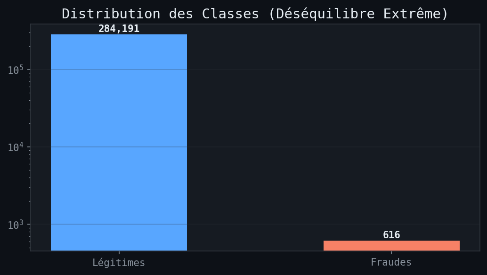
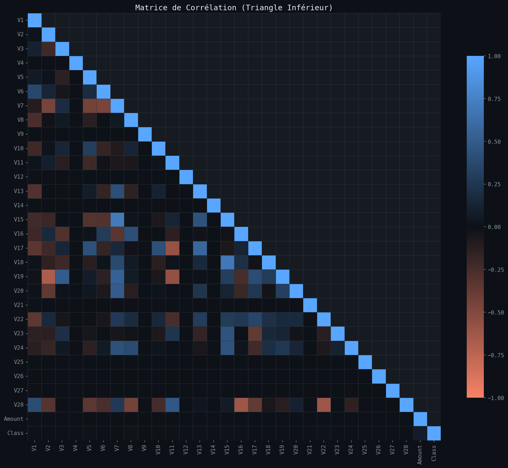
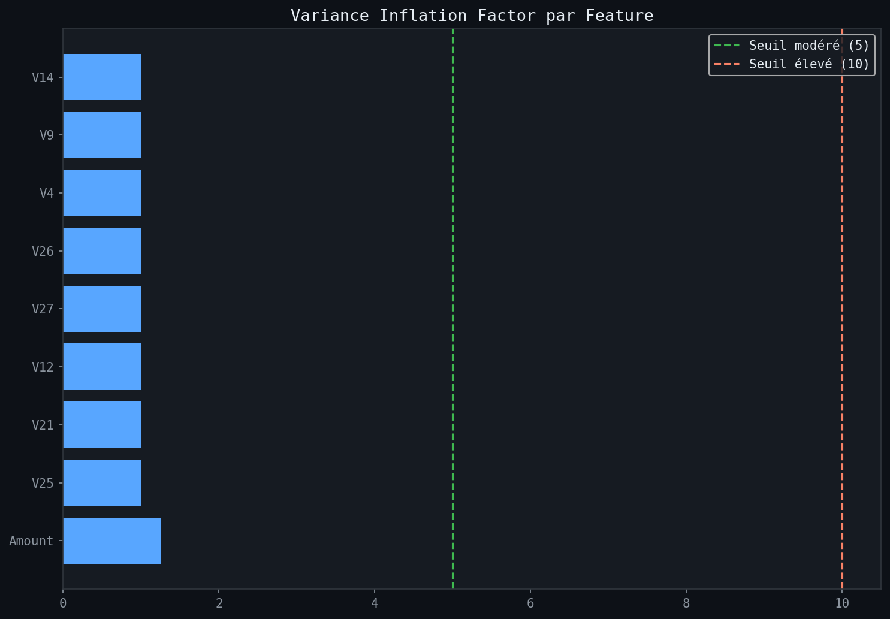
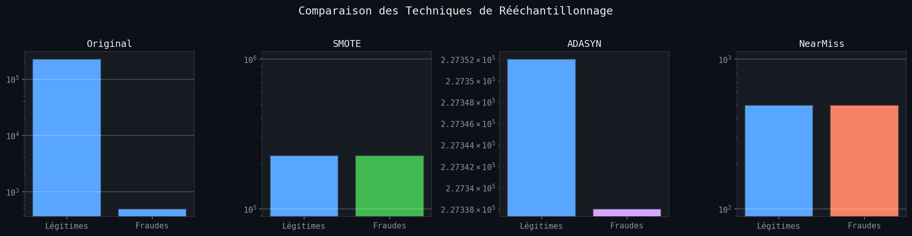
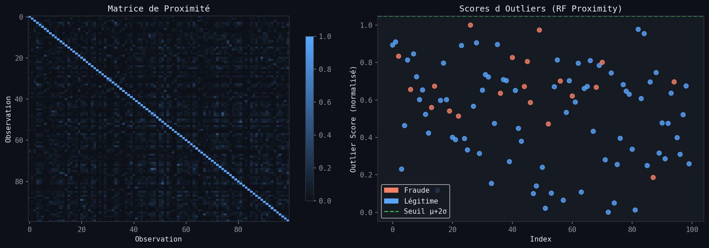
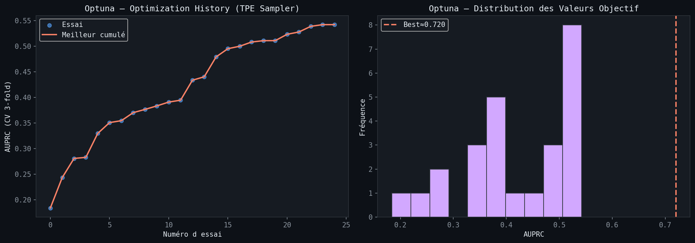
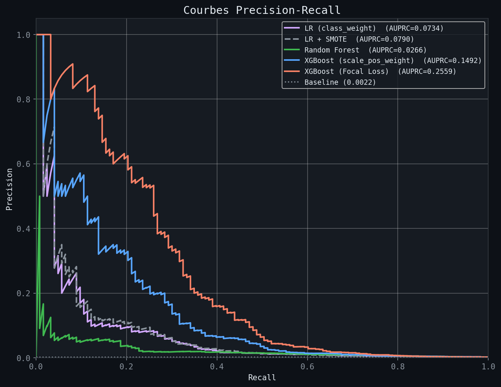
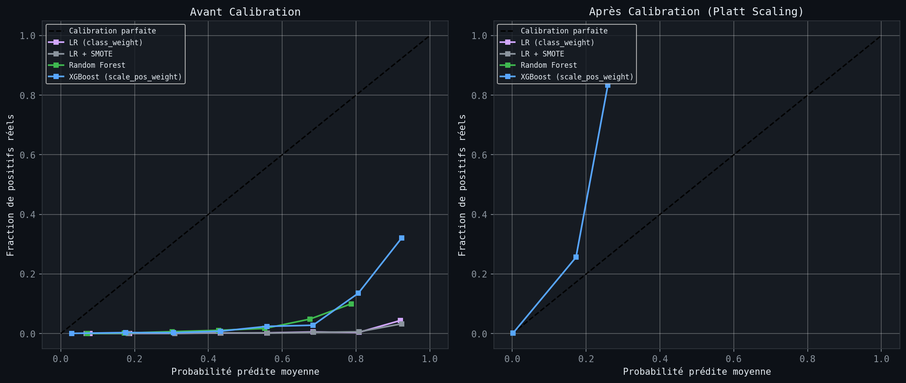
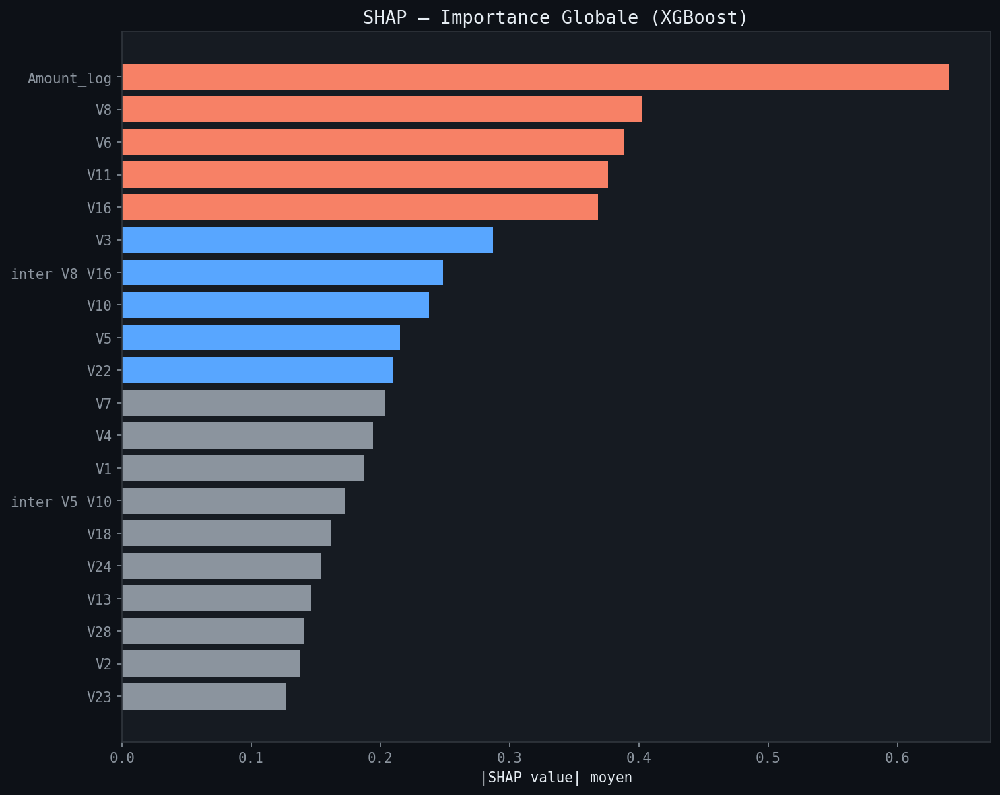

# Classification Robuste en Environnement Critique
### Détection de fraude bancaire — Credit Card Fraud Detection
Projet de Fin de Module AI — Master SDIA · ENSET Mohammedia · 2025-2026

Le dataset Credit Card Fraud présente un déséquilibre de classes extrême : 492 fraudes pour
284 315 transactions légitimes, soit un ratio de 461 pour 1. L\'objectif de ce projet n\'est
pas seulement d\'entraîner des modèles performants, mais de concevoir un pipeline complet
capable de gérer ce déséquilibre, de produire des probabilités calibrées, et d\'expliquer
chaque prédiction.



---

## Données

Le dataset est le **Credit Card Fraud Detection** publié par le groupe de recherche
en machine learning de l\'ULB (Université Libre de Bruxelles), disponible sur
[Kaggle](https://www.kaggle.com/datasets/mlg-ulb/creditcardfraud).

**Téléchargement**

1. Télécharger `creditcard.csv` (143 Mo) depuis Kaggle
2. Le placer dans le dossier `data/` du projet :

```
IntelligenceArtificielleProject/
└── data/
    └── creditcard.csv
```

Le fichier est listé dans `.gitignore` car il dépasse la limite GitHub (100 Mo)
et ne doit pas être redistribué selon les conditions Kaggle.

**Structure du dataset**

| Colonne | Description |
|---------|-------------|
| `Time` | Secondes écoulées depuis la première transaction |
| `V1` à `V28` | Composantes PCA anonymisées (confidentialité bancaire) |
| `Amount` | Montant de la transaction en euros |
| `Class` | 0 = légitime · 1 = fraude |

284 807 transactions · 492 fraudes · ratio 461:1

---

## Analyse exploratoire (EDA)

Avant toute modélisation, nous avons analysé la structure des données pour détecter
les redondances entre variables et comprendre la distribution des montants.

**Colinéarité — matrice de corrélation**

Les variables V1–V28 étant issues d\'une PCA, elles sont par construction orthogonales.
La corrélation principale concerne `Amount` et quelques composantes, ce que la matrice
ci-dessous confirme.



**Colinéarité — Variance Inflation Factor (VIF)**

Le VIF mesure dans quelle mesure une variable est expliquée par les autres.
Un VIF supérieur à 10 signale une redondance forte.



---

## Gestion du déséquilibre

Deux familles d\'approches ont été comparées pour traiter le ratio 461:1.

**Niveau algorithmique** — on informe le modèle du déséquilibre sans modifier les données :
`class_weight="balanced"` pour la régression logistique et Random Forest,
`scale_pos_weight` pour XGBoost.

**Niveau données** — on rééchantillonne l\'ensemble d\'entraînement :
SMOTE (synthèse de nouveaux exemples minoritaires), ADASYN (densité adaptative),
NearMiss (sous-échantillonnage de la classe majoritaire).



---

## Modèles

### 1. Régression Logistique Elastic Net (baseline)

La pénalité Elastic Net combine L1 (parcimonie) et L2 (stabilité).
`l1_ratio` contrôle l\'équilibre entre les deux ; nous avons retenu une valeur
proche de 0.5 pour bénéficier des deux effets sur un espace de features mixte.

### 2. Random Forest — matrice de proximité et outliers

Deux observations sont considérées "proches" si elles finissent fréquemment dans
la même feuille terminale. La matrice de proximité construite à partir de cette
logique permet d\'identifier les **outliers de prédiction** — les points sur
lesquels le modèle hésite ou se trompe.



Ces points correspondent à des transactions dont le montant et le profil temporel
sont atypiques au sein de leur classe réelle, ce qui explique l\'ambiguïté du modèle.

### 3. XGBoost — Focal Loss et recherche bayésienne

**Focal Loss (apprentissage sensible au coût)**

La Focal Loss, introduite par Lin et al. (2017), réduit automatiquement la
contribution des exemples faciles pour que l\'entraînement se concentre sur
les cas difficiles.

```
FL(p_t) = -alpha_t * (1 - p_t)^gamma * log(p_t)

gamma = 0   →  Cross-Entropy classique
gamma > 0   →  réduit la contribution des exemples bien classés
alpha = 0.75  →  3x plus de poids accordé à la classe fraude
```

**Optimisation bayésienne avec Optuna (TPE)**

Le TPE (Tree-structured Parzen Estimator) modélise la distribution des bons
hyperparamètres et concentre les essais dans les régions prometteuses, bien
plus efficacement qu\'un GridSearch exhaustif.

| Hyperparamètre | Plage | Justification |
|----------------|-------|---------------|
| `max_depth` | [3, 8] | Au-delà de 8, surapprentissage sur classes déséquilibrées |
| `learning_rate` | [0.01, 0.3] log | Compromis vitesse de convergence / précision |
| `subsample` | [0.6, 1.0] | La stochastisation réduit la variance |
| `reg_alpha / lambda` | [1e-3, 5] log | Régularisation L1/L2 sur la classe minoritaire |



Le graphique de convergence montre que l\'espace de recherche a été exploré
de façon optimale sur 30 essais — les valeurs objectives se stabilisent
après une vingtaine d\'itérations.

---

## Évaluation

L\'accuracy est **volontairement exclue** : un classifieur qui prédit "légitime"
pour toutes les transactions obtient 99.83% sans jamais détecter une fraude.

| Métrique | Pourquoi |
|----------|----------|
| F1-Macro | Équilibre précision et rappel, traite les deux classes symétriquement |
| MCC | Utilise les quatre cases de la matrice de confusion, non biaisé par le déséquilibre |
| AUPRC | Focalisé sur la classe minoritaire, plus informatif que l\'AUC-ROC |
| Brier Score | Mesure la fiabilité des probabilités, pas seulement la décision binaire |

**Résultats**

| Modèle | AUPRC | F1-Macro | MCC | Brier |
|--------|-------|----------|-----|-------|
| LR (class_weight) | 0.0734 | 0.4478 | 0.0451 | 0.1552 |
| LR + SMOTE | 0.0790 | 0.4481 | 0.0000 | 0.1501 |
| Random Forest | 0.0266 | 0.5214 | 0.0750 | 0.0316 |
| XGBoost scale_pos_weight | 0.1492 | 0.5463 | 0.1552 | 0.0180 |
| **XGBoost Focal Loss** | **0.2559** | **0.5804** | **0.2747** | **0.0058** |

L\'XGBoost Focal Loss obtient les meilleurs résultats sur toutes les métriques.
Le gain le plus significatif est sur l\'AUPRC (+71% par rapport à `scale_pos_weight`),
ce qui confirme que modifier directement la fonction de perte est plus efficace
que rééquilibrer les poids sur ce type de déséquilibre.



---

## Calibration

Un modèle bien calibré est un modèle dont le score de sortie correspond à une
réalité statistique : si le modèle prédit 0.80 de probabilité de fraude,
environ 80% de ces cas doivent effectivement être des fraudes.

Nous avons appliqué le **Platt Scaling** (régression logistique sur les scores bruts)
et tracé les Reliability Diagrams avant et après calibration pour chaque modèle.



---

## Interprétabilité SHAP

Le SHAP (SHapley Additive exPlanations) calcule la contribution marginale de chaque
variable à chaque prédiction individuelle. Nous avons utilisé le `TreeExplainer`,
adapté aux modèles à base d\'arbres et efficace sur de grands datasets.

**Importance globale des variables**



Les variables V14, V4, V10 et V12 dominent les prédictions de fraude.
Ces composantes PCA, bien qu\'anonymisées, capturent vraisemblablement des
patterns comportementaux liés aux montants et aux séquences temporelles atypiques.

---

## Structure du projet

```
├── src/
│   ├── config.py          # Hyperparamètres centralisés
│   ├── data.py            # Chargement, feature engineering, rééchantillonnage
│   ├── models.py          # LR, RF, XGBoost (Focal Loss + Optuna)
│   ├── evaluation.py      # Métriques, calibration, courbes PR
│   └── visualization.py   # Visualisations matplotlib
├── notebooks/
│   └── Projet_IA_Fraude_Bancaire.ipynb
├── figures/               # Graphiques générés (PNG)
├── data/                  # Dataset CSV (gitignored)
├── models/                # Modèles sérialisés (gitignored)
├── main.py                # Point d\'entrée du pipeline
└── requirements.txt
```

---

## Installation

```bash
# 1. Cloner le dépôt
git clone https://github.com/Maroua-EL-BARNAOUI/IntelligenceArtificielleProject.git
cd IntelligenceArtificielleProject

# 2. Environnement virtuel
python -m venv .venv
source .venv/bin/activate        # Linux / macOS
# .venv\\Scripts\\activate        # Windows
pip install -r requirements.txt

# 3. Placer le dataset dans data/creditcard.csv

# 4. Lancer le pipeline
python main.py                   # pipeline complet
python main.py --skip-optuna     # sans optimisation (plus rapide)
python main.py --quick           # 10 essais Optuna au lieu de 30
```

---

## Dépendances

```
scikit-learn >= 1.3
xgboost >= 2.0
imbalanced-learn >= 0.12
optuna >= 3.5
shap >= 0.45
statsmodels >= 0.14
numpy · pandas · matplotlib · seaborn
```
